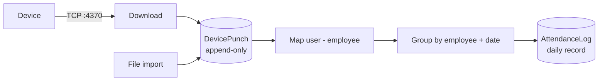

# Fingerprint Device Integration — Design

ZKTeco TCP/IP device integration for the Attendance Management System.
Companion to [ARCHITECTURE.md](ARCHITECTURE.md).

Status: **design proposal**, not yet implemented.

---

## 1. The governing idea

The system already has a working punch-processing pipeline:
`BiometricImportService.ProcessPunchesAsync` takes `List<BiometricPunchDto>`, maps device
enroll ids to employees, groups by (employee, date), and writes `AttendanceLog` rows with
first-punch-in / last-punch-out.

**The device module's responsibility ends at producing `BiometricPunchDto` records.**

```
File (.mdb/.xlsx/.csv) ─┐
                        ├─→ BiometricPunchDto[] ─→ [ existing pipeline ] ─→ AttendanceLog
ZKTeco device (TCP/IP) ─┘
```

Everything downstream — enroll-id mapping, punch pairing, late/early derivation, the unique
`(EmployeeId, AttendanceDate)` index — is reused unchanged. This is the single most important
decision in the design: it keeps the new module small, and it guarantees that a punch behaves
identically whether it arrived by cable or by USB stick.

Design constraints, in priority order:

1. **Never lose a punch.** A device that has been offline for three days must catch up.
2. **Never double-count a punch.** Re-running a sync must be a no-op.
3. **Device failure must not affect the web application.** A dead device is a row with a red dot.
4. **Simple enough to debug from the UI** at 2am when payroll is due.

---

## 2. Protocol and library — the decision that shapes everything

ZKTeco devices speak a proprietary protocol over TCP/UDP port 4370. There are two routes:

| Option | Reality |
|---|---|
| **Official `zkemkeeper.dll`** (COM SDK) | Feature-complete, vendor-supported. But it is **32-bit COM**: requires `regsvr32` on the host, forces the process to **x86**, and is Windows-only. Hosting it inside ASP.NET Core means an x86 web app and native crashes taking down the site. |
| **Managed protocol client** (pure C#) | No registration, no bitness constraint, no COM. Community implementations of the protocol are widely used. Less complete — but this module needs only *read attendance logs*, *read users*, *get device time*, *ping*. |

**Recommendation: a managed client, behind an interface.**

The feature list here needs a small fraction of the SDK. Paying for the full SDK's deployment
pain to get features we do not use is a bad trade. More importantly, the interface below means
the choice is reversible — if a customer's device model needs the official SDK, implement the
same interface over `zkemkeeper` and register it for that device, with nothing else changing.

```csharp
// AttendanceSystem.Application/Interfaces/IFingerprintDeviceClient.cs
public interface IFingerprintDeviceClient
{
    Task<Result> TestConnectionAsync(DeviceConnection cx, CancellationToken ct = default);

    /// <summary>Device's own clock — used to detect drift before trusting punch timestamps.</summary>
    Task<Result<DateTime>> GetDeviceTimeAsync(DeviceConnection cx, CancellationToken ct = default);

    /// <summary>All attendance records at or after <paramref name="from"/>.</summary>
    Task<Result<IReadOnlyList<DevicePunchRecord>>> ReadAttendanceLogsAsync(
        DeviceConnection cx, DateTime from, CancellationToken ct = default);

    /// <summary>Enrolled users — drives the ID-mapping screen.</summary>
    Task<Result<IReadOnlyList<DeviceUserRecord>>> ReadUsersAsync(
        DeviceConnection cx, CancellationToken ct = default);
}

public record DeviceConnection(string IpAddress, int Port, int? CommKey, TimeSpan Timeout);
public record DevicePunchRecord(string DeviceUserId, DateTime PunchTime, int VerifyMode, int InOutMode);
public record DeviceUserRecord(string DeviceUserId, string? Name, string? CardNumber);
```

Four methods. That is the entire surface area between this system and any fingerprint hardware.

> **Do not** let device types leak past this interface. The moment a `zkemkeeper` type appears
> in a service or controller, the abstraction is dead and swapping protocols becomes a rewrite.

---

## 3. Domain model

Four new entities. All inherit `BaseEntity` (soft delete + audit stamping) except the
append-only ones, following the `AuditLog` precedent.

```csharp
/// <summary>A physical fingerprint terminal.</summary>
public class Device : BaseEntity
{
    public string Name { get; set; }              // "Head Office - Main Gate"
    public string IpAddress { get; set; }
    public int Port { get; set; } = 4370;
    public int? CommKey { get; set; }             // device comm password, 0/null when unset
    public string? SerialNumber { get; set; }     // read from device, useful for support
    public string? Model { get; set; }

    public int BranchId { get; set; }             // "Assign Device to Branch"
    public Branch Branch { get; set; }

    public bool IsActive { get; set; } = true;    // excluded from auto-sync when false
    public bool AutoSyncEnabled { get; set; } = true;

    // ── Sync state ────────────────────────────────────────────────
    /// <summary>Watermark: punches at or after this time are re-requested. See §5.</summary>
    public DateTime? LastPunchTimeSynced { get; set; }
    public DateTime? LastSyncStartedAt { get; set; }
    public DateTime? LastSuccessfulSyncAt { get; set; }
    public int ConsecutiveFailures { get; set; }

    // ── Status ────────────────────────────────────────────────────
    public DateTime? LastSeenAt { get; set; }
    public DeviceStatus Status { get; set; } = DeviceStatus.Unknown;
    public string? LastError { get; set; }
}

public enum DeviceStatus { Unknown = 0, Online = 1, Offline = 2, Error = 3 }
```

```csharp
/// <summary>
/// A raw punch exactly as the device reported it. Append-only, never edited.
///
/// This table is the reason the module is reliable: it is the idempotency boundary
/// (§5) and the replay source (§4). Keep it dumb — no interpretation here.
/// </summary>
public class DevicePunch
{
    public long Id { get; set; }
    public int DeviceId { get; set; }
    public Device Device { get; set; }

    public string DeviceUserId { get; set; }      // as reported; string, not int - see §7
    public DateTime PunchTime { get; set; }
    public int VerifyMode { get; set; }           // finger / card / password
    public int InOutMode { get; set; }            // device's own in/out flag, advisory only

    public DateTime DownloadedAt { get; set; }

    /// <summary>Null until matched to an employee; non-null once processed.</summary>
    public int? EmployeeId { get; set; }
    public bool IsProcessed { get; set; }
}
```

```csharp
/// <summary>Maps a device's user id to a system employee, per device.</summary>
public class DeviceUserMapping : BaseEntity
{
    public int DeviceId { get; set; }
    public string DeviceUserId { get; set; }
    public int EmployeeId { get; set; }
}
```

```csharp
/// <summary>One row per sync attempt — powers both "History" and "Error Logs".</summary>
public class DeviceSyncLog
{
    public long Id { get; set; }
    public int DeviceId { get; set; }

    public SyncTrigger Trigger { get; set; }      // Manual | Scheduled
    public DateTime StartedAt { get; set; }
    public DateTime? CompletedAt { get; set; }
    public SyncOutcome Outcome { get; set; }      // Success | PartialSuccess | Failed

    public int PunchesRead { get; set; }
    public int PunchesInserted { get; set; }      // read - inserted = duplicates skipped
    public int PunchesUnmapped { get; set; }      // no employee for that device user id
    public int AttendanceRecordsAffected { get; set; }

    public string? ErrorMessage { get; set; }
    public int? TriggeredByUserId { get; set; }
}
```

### Indexes that matter

```csharp
// THE duplicate guard. Everything in §5 depends on this.
modelBuilder.Entity<DevicePunch>()
    .HasIndex(p => new { p.DeviceId, p.DeviceUserId, p.PunchTime })
    .IsUnique();

modelBuilder.Entity<DevicePunch>().HasIndex(p => new { p.IsProcessed, p.PunchTime });
modelBuilder.Entity<DeviceUserMapping>().HasIndex(m => new { m.DeviceId, m.DeviceUserId }).IsUnique();
modelBuilder.Entity<Device>().HasIndex(d => new { d.IpAddress, d.Port }).IsUnique();
modelBuilder.Entity<DeviceSyncLog>().HasIndex(l => new { l.DeviceId, l.StartedAt });
```

---

## 4. The two-stage pipeline



**Stage 1 — Download.** Read punches, insert into `DevicePunch`, ignore rows that violate the
unique index. Nothing is interpreted. This stage is idempotent by construction.

**Stage 2 — Process.** Take unprocessed punches, map to employees, hand to the existing
`ProcessPunchesAsync`, mark processed.

Splitting these is what makes the module operable:

- A bug in punch pairing is fixed by **replaying stage 2** — no device contact, no data loss.
- An employee mapped a week late gets their history by re-processing their punches.
- "The device says he clocked in at 08:55 but the system says absent" is answerable, because
  the raw record is still there next to the derived one.

A single-stage design that writes `AttendanceLog` directly is simpler to build and materially
worse to run. Do not collapse these.

---

## 5. Incremental sync and duplicate prevention

Two mechanisms, deliberately overlapping.

### Watermark — "new logs only"

Each device stores `LastPunchTimeSynced`. A sync requests punches from
`LastPunchTimeSynced - overlap`, where **overlap defaults to 2 days**.

The overlap is not redundancy, it is correctness insurance:

- Device clocks drift, and a corrected clock can make "new" punches appear *before* the watermark.
- A punch written to the device during the previous download window can be missed.
- A device offline for a week is caught up automatically on next contact.

For a first-ever sync, `LastPunchTimeSynced` is null and the initial window is configurable
(default 30 days) so a new device does not drag in years of history.

> ZKTeco devices expose a record index, and it is tempting to track "last index read". Do not.
> The index resets when device storage is cleared, which silently re-imports everything or skips
> everything. A timestamp watermark plus the unique index degrades gracefully; an index does not.

### Unique index — the actual guarantee

`(DeviceId, DeviceUserId, PunchTime)` unique. The watermark decides *what to ask for*; the index
decides *what gets stored*. Overlapping windows are therefore free.

```csharp
// Insert-if-absent, tolerant of concurrent syncs
var existing = await _uow.DevicePunches.FindAsync(p =>
    p.DeviceId == deviceId && p.PunchTime >= windowStart);
var seen = existing
    .Select(p => (p.DeviceUserId, p.PunchTime))
    .ToHashSet();

var fresh = downloaded
    .Where(r => !seen.Contains((r.DeviceUserId, r.PunchTime)))
    .ToList();
```

Even if two syncs race, the database rejects the second insert. Catch the unique-violation and
count it as a skip — never as an error.

---

## 6. Services

```
IDeviceService            CRUD, branch assignment, test connection, status
IDeviceSyncService        download + process, one device or all
IDeviceMappingService     device users <-> employees
IFingerprintDeviceClient  protocol boundary (§2)  ── Infrastructure only
```

All return `Result` / `Result<T>` and take `ICurrentUserContext` for attribution, matching the
existing services.

```csharp
public interface IDeviceSyncService
{
    /// <summary>Download + process one device. Used by the Sync Now button and the scheduler.</summary>
    Task<Result<DeviceSyncResultDto>> SyncDeviceAsync(int deviceId, SyncTrigger trigger, CancellationToken ct = default);

    /// <summary>Every active auto-sync device. Failures are per-device and do not abort the run.</summary>
    Task<Result<IReadOnlyList<DeviceSyncResultDto>>> SyncAllAsync(CancellationToken ct = default);

    /// <summary>Stage 2 only — re-derive attendance from punches already downloaded.</summary>
    Task<Result<DeviceSyncResultDto>> ReprocessAsync(int deviceId, DateTime from, DateTime to, CancellationToken ct = default);
}
```

`ReprocessAsync` is the operational escape hatch. It costs almost nothing to add now and is the
difference between a five-minute fix and a database restore later.

---

## 7. Employee ID mapping

The system already has `Employee.BiometricEnrollId` (an `int?`), used by the file importer.
It is kept, but it is **not** sufficient for a multi-device deployment:

- The same person can hold different enroll ids on two devices.
- Two people at different branches can hold the *same* enroll id.

With a single global column, the second case silently attributes one employee's attendance to
another — a payroll error that is very hard to spot.

**Design:** `DeviceUserMapping (DeviceId, DeviceUserId → EmployeeId)` is authoritative.
`BiometricEnrollId` becomes the auto-match hint.

`DeviceUserId` is a **string**, not an int. Device user ids are not reliably numeric across
models, and parsing them to int is a defect waiting for the customer who uses alphanumeric ids.

### Mapping screen flow

1. **Pull Users** — `ReadUsersAsync` fetches everyone enrolled on the device.
2. **Auto-match** — by `BiometricEnrollId`, then by `EmployeeCode`. Proposed matches shown, not applied.
3. **Confirm / correct** — operator resolves the rest from a dropdown.
4. **Unmapped list stays visible** — permanently, on the device page.

That last point matters. Right now **all 11 employees in the live database have
`BiometricEnrollId = NULL`**, which means a device import today would match nothing and silently
record everyone absent. The unmapped count must be a standing, visible number — not a warning
buried in one import's output.

Unmapped punches are still **stored** in `DevicePunch` with `EmployeeId = null`. When the mapping
is created later, `ReprocessAsync` recovers the history. Discarding unmatched punches at download
time loses data permanently; this is the difference.

---

## 8. Automatic synchronisation

A `BackgroundService` in the web host:

```csharp
public sealed class DeviceSyncBackgroundService : BackgroundService
{
    protected override async Task ExecuteAsync(CancellationToken stoppingToken)
    {
        while (!stoppingToken.IsCancellationRequested)
        {
            try
            {
                // Scoped: the DbContext and services are per-iteration, not per-process.
                using var scope = _scopeFactory.CreateScope();
                var sync = scope.ServiceProvider.GetRequiredService<IDeviceSyncService>();
                await sync.SyncAllAsync(stoppingToken);
            }
            catch (Exception ex)
            {
                // A scheduler that dies on one bad device stops all attendance collection.
                _logger.LogError(ex, "Device sync cycle failed");
            }

            await Task.Delay(_interval, stoppingToken);
        }
    }
}
```

Points that are easy to get wrong:

- **Create a DI scope per cycle.** `BackgroundService` is a singleton; capturing a scoped
  `DbContext` gives a context that lives for the life of the process and leaks memory.
- **Catch everything inside the loop.** An escaped exception ends the service silently and
  attendance stops being collected with no visible symptom until payroll.
- **Sync devices sequentially**, with a per-device timeout. Ten devices hammering one SQL Server
  at 5-minute intervals is a self-inflicted load problem; the work is tiny and latency does not matter.
- **Guard against overlap.** If a cycle runs long, the next must not start on the same device —
  `LastSyncStartedAt` with a staleness threshold is sufficient at this scale.

Interval and initial-window live in `CompanySettings` (5 minutes is a sensible default).

### Deployment note

This assumes the web host can reach the devices on port 4370 — true when the application runs
on-premise on the same LAN, which is the normal deployment for this product.

**If the application is ever hosted off-site, this breaks**, and the fix is not to punch a hole in
the firewall: move `DeviceSyncBackgroundService` into a small on-premise worker that talks to the
same database, or have it push to an API. The service boundary above already allows this — it is
why device communication sits behind an interface and the scheduler owns no business logic.

---

## 9. Device status

Status is **derived from sync outcomes**, plus a lightweight poll for idle devices:

| Condition | Status |
|---|---|
| Last contact succeeded within 2 sync intervals | **Online** |
| Contact failed, `ConsecutiveFailures` < 3 | **Offline** |
| `ConsecutiveFailures` >= 3 | **Error** (with `LastError`) |
| Never contacted | **Unknown** |

Do not hold persistent connections. ZKTeco devices tolerate a small number of concurrent sessions
and hold them poorly; connect, do the work, disconnect. "Online" means *reachable when last
asked*, and the UI should say when that was rather than implying live monitoring.

**Test Connection** is the same call, invoked on demand, reporting device time alongside — clock
drift is the most common real cause of "the attendance is wrong" and should be visible where the
operator is already looking. Flag drift over ~2 minutes.

---

## 10. Permissions

A new `Devices` module in `AppConstants.Modules`, with `View`, `Create`, `Edit`, `Delete`
and a custom `Sync` action.

| Endpoint | Permission |
|---|---|
| `GET /api/devices` | `Devices.View` |
| `POST /api/devices` | `Devices.Create` |
| `PUT /api/devices/{id}` | `Devices.Edit` |
| `DELETE /api/devices/{id}` | `Devices.Delete` |
| `POST /api/devices/{id}/test` | `Devices.View` |
| `POST /api/devices/{id}/sync` | `Devices.Sync` |
| `GET /api/devices/{id}/sync-history` | `Devices.View` |
| `GET/POST /api/devices/{id}/mappings` | `Devices.Edit` |

> **Deployment warning, learned the hard way on this system.** Adding a module to
> `PermissionCatalogue` only affects *new* databases — the seed does not re-run on a database whose
> migration is already recorded. The `Import` module was added this way and the page 403'd for
> every user, including Administrator, because the permission row did not exist and therefore
> could not be granted.
>
> **Ship a data migration that inserts the `Devices` permission rows and grants them to
> Administrator**, and append to `PermissionCatalogue` without reordering existing entries — their
> ids are positional.

---

## 11. Screens

**Devices** (list) — name, branch, IP:port, status dot, last successful sync, unmapped count.
Actions: Test, Sync Now, Edit, Delete.

**Device detail** — three tabs:
- *Settings* — name, IP, port, comm key, branch, active, auto-sync
- *Employee Mapping* — pull users, auto-match, confirm; unmapped shown first
- *Sync History* — the `DeviceSyncLog` rows, failures highlighted, expandable error text

Both sit under the existing **Attendance & Leave** sidebar group, beside Biometric Import. The
file importer stays — it is the fallback when a device is unreachable, and it now shares the same
punch store.

---

## 12. Failure modes this design handles

| Failure | Behaviour |
|---|---|
| Device offline for days | Watermark + overlap catches up on reconnect; no loss |
| Sync runs twice concurrently | Unique index rejects duplicates; counted as skips |
| Employee mapped after the fact | Punches retained unmapped; `ReprocessAsync` recovers history |
| Device clock drift | Surfaced by Test Connection; overlap window absorbs small drift |
| Pairing logic bug | Fix and replay stage 2 — raw punches are intact |
| Network drop mid-download | Transaction rolls back; watermark unchanged; next cycle retries |
| Device storage cleared | Timestamp watermark unaffected (an index-based one would not survive) |
| One device faulty | Per-device failure isolation; others continue |

Two that it does **not** solve, and should be stated plainly:

- **Employee not enrolled on the device.** No software fix; the unmapped count makes it visible.
- **Daylight-saving transitions.** The system stores local `DateTime` throughout
  (see ARCHITECTURE.md §8). Punches during a DST shift can be ambiguous. Out of scope here, but
  it is an argument for moving the system to `DateTimeOffset`.

---

## 13. Out of scope for v1

Deliberately excluded to keep the module small: pushing employees/fingerprints *to* devices,
remote door control, live event streaming, real-time push (ADMS/WebSocket), remote firmware
management, and non-ZKTeco vendors.

Each is a genuine feature; none is needed to collect attendance reliably, and every one enlarges
the protocol surface that must be maintained. `IFingerprintDeviceClient` is where they would go.

---

## 14. Implementation order

| Phase | Deliverable | Value on its own |
|---|---|---|
| 1 | Entities, migration, `Devices` CRUD + branch assignment, permissions | Devices are recorded |
| 2 | `IFingerprintDeviceClient` + Test Connection + status | Proves the protocol works before building on it |
| 3 | Mapping screen (pull users, auto-match) | Fixes the 11 NULL enroll ids blocking any import |
| 4 | Manual sync — stage 1 + stage 2 + sync history | Feature-complete for a single operator |
| 5 | `BackgroundService` auto-sync + error log screen | Unattended operation |
| 6 | `ReprocessAsync` | Operational safety net |

Phase 2 before anything else is built on top: if the chosen client cannot talk to the customer's
actual device model, that must be discovered in week one, not after the UI is written.

Phase 3 has value **today**, independent of any device work — the mapping data is currently empty
and the existing file importer cannot match anyone without it.
